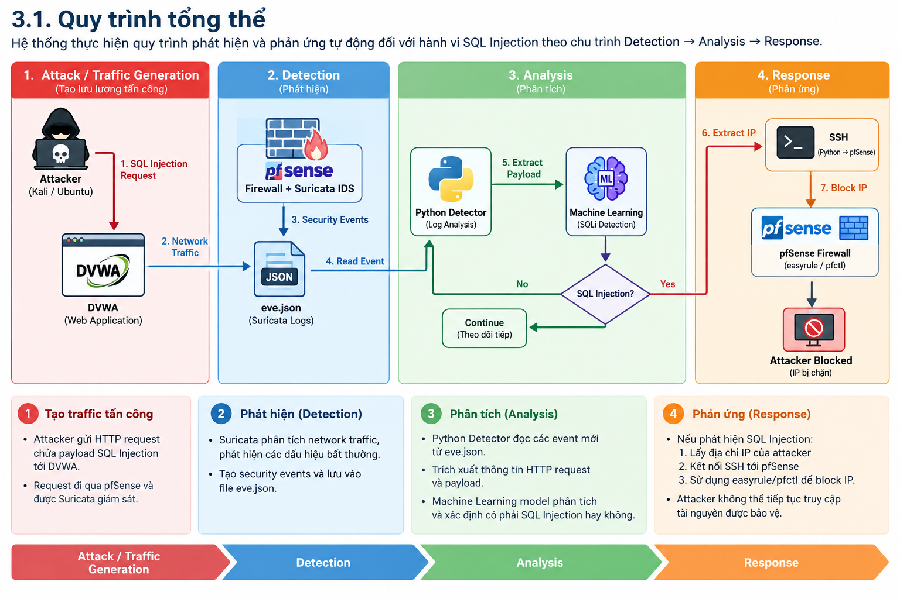

# AI-Suricata-pfSense-IPS

Hệ thống phát hiện và ngăn chặn tấn công **SQL Injection** theo thời gian thực, kết hợp **Suricata IDS**, **Machine Learning** và **pfSense Firewall**.

Project được xây dựng nhằm mô phỏng quy trình **SOC/Blue Team**, trong đó security events được thu thập từ Suricata, phân tích bằng Machine Learning và tự động phản ứng bằng cách chặn địa chỉ IP của nguồn tấn công trên pfSense.

---

## 1. Mục tiêu

Project được xây dựng nhằm mô phỏng một hệ thống **Detection & Response** trong môi trường SOC/Blue Team, tập trung vào việc phát hiện và ngăn chặn tấn công SQL Injection.

Các mục tiêu chính:

- Phát hiện các dấu hiệu của tấn công **SQL Injection**.
- Thu thập và phân tích **security events** từ Suricata.
- Sử dụng **Machine Learning** để hỗ trợ phân loại và phát hiện payload SQL Injection.
- Xác định địa chỉ IP của nguồn thực hiện tấn công.
- Tự động gửi yêu cầu chặn IP tới **pfSense Firewall** khi phát hiện hành vi tấn công.
- Mô phỏng quy trình xử lý sự cố theo chu trình **Detection → Analysis → Response**.
- Minh họa khả năng kết hợp giữa **Network IDS, Machine Learning và Firewall** trong hệ thống phòng thủ mạng.

---

## 2. Kiến trúc hệ thống

Hệ thống được xây dựng theo mô hình phòng thủ nhiều lớp, kết hợp **Network IDS**, **Machine Learning** và **Firewall** để phát hiện và ngăn chặn tấn công SQL Injection trong môi trường lab.

### 2.1. Sơ đồ kiến trúc

```text
┌─────────────────┐
│    Attacker     │
│   Kali / Ubuntu │
└────────┬────────┘
         │
         │ HTTP Request
         │ SQL Injection
         ▼
┌─────────────────┐
│      DVWA       │
│ Vulnerable Web  │
│   Application   │
└────────┬────────┘
         │
         │ Network Traffic
         ▼
┌─────────────────┐
│     pfSense     │
│    Firewall     │
│        +        │
│    Suricata     │
│      IDS        │
└────────┬────────┘
         │
         │ Security Events
         │
         ▼
┌─────────────────┐
│    eve.json     │
│  Suricata Logs  │
└────────┬────────┘
         │
         │ Event Data
         ▼
┌─────────────────┐
│ Python Detector │
│                 │
│  Log Analysis   │
│       +         │
│  Machine        │
│  Learning       │
└────────┬────────┘
         │
         │ SQLi Detected
         ▼
┌─────────────────┐
│      SSH        │
│        ↓        │
│     pfSense     │
│   easyrule      │
│   block <IP>    │
└────────┬────────┘
         │
         ▼
┌─────────────────┐
│ Attacker IP     │
│     Blocked     │
└─────────────────┘
```
### 2.2. Vai trò và các thành phần
| Thành phần           | Vai trò                                                             |
| -------------------- | ------------------------------------------------------------------- |
| **Attacker**         | Mô phỏng nguồn thực hiện tấn công SQL Injection                     |
| **DVWA**             | Web application dễ bị khai thác, được sử dụng làm mục tiêu kiểm thử |
| **pfSense**          | Firewall thực hiện kiểm soát network traffic và chặn địa chỉ IP     |
| **Suricata**         | Network IDS giám sát traffic và tạo security events                 |
| **eve.json**         | Lưu trữ các security events do Suricata tạo ra                      |
| **Python Detector**  | Đọc và xử lý security events theo thời gian thực                    |
| **Machine Learning** | Phân tích payload và hỗ trợ phát hiện SQL Injection                 |
| **SSH**              | Kết nối từ Python Detector tới pfSense để thực hiện phản ứng        |
| **easyrule / pfctl** | Thực hiện cơ chế block IP trên pfSense                              |

### 2.3. Nguyên lý hoạt động

Kiến trúc hệ thống được chia thành ba lớp chính:

1. Detection Layer

Suricata được triển khai trên pfSense để giám sát network traffic. Khi phát hiện hoặc ghi nhận các sự kiện liên quan đến HTTP traffic, Suricata tạo security events và lưu vào eve.json.

2. Analysis Layer

Python Detector theo dõi các security events mới từ eve.json, trích xuất thông tin cần thiết từ HTTP request và sử dụng Machine Learning model để hỗ trợ xác định payload có dấu hiệu SQL Injection.

3. Response Layer

Khi xác định được hành vi SQL Injection, Python Detector lấy địa chỉ IP của nguồn tấn công và sử dụng SSH để gửi lệnh tới pfSense. pfSense sau đó thực hiện block IP nhằm ngăn nguồn tấn công tiếp tục truy cập.

### 2.4. Mối quan hệ giữa các thành phần
Attacker
   │
   │ SQL Injection
   ▼
DVWA
   │
   │ Network Traffic
   ▼
pfSense + Suricata
   │
   │ Security Events
   ▼
eve.json
   │
   │ Event Data
   ▼
Python Detector
   │
   │ Payload Analysis
   ▼
Machine Learning
   │
   │ SQLi Detected
   ▼
SSH → pfSense
   │
   │ Block IP
   ▼
Attacker Blocked
## 3. Luồng hoạt động

Hệ thống thực hiện quy trình phát hiện và phản ứng tự động đối với hành vi SQL Injection theo chu trình **Detection → Analysis → Response**.

### 3.1. Quy trình tổng thể

Hệ thống thực hiện quy trình phát hiện và phản ứng tự động đối với hành vi SQL Injection theo chu trình **Detection → Analysis → Response**.



*Hình 3.1. Quy trình phát hiện và phản ứng tự động đối với hành vi SQL Injection*


### 3.2. Các bước xử lý

Bước 1 – Tạo traffic tấn công
Attacker sử dụng máy Kali Linux hoặc Ubuntu để gửi HTTP request chứa payload SQL Injection tới ứng dụng DVWA.

Bước 2 – Giám sát network traffic
Traffic đi qua pfSense và được Suricata giám sát. Suricata phân tích các gói tin và tạo security events tương ứng.

Bước 3 – Ghi nhận security event
Các event được Suricata ghi vào file eve.json, bao gồm những thông tin cần thiết cho quá trình phân tích.

Bước 4 – Python Detector đọc event
Chương trình realtime_ids.py theo dõi eve.json và xử lý các event mới được ghi nhận.

Bước 5 – Phân tích payload
Python Detector trích xuất thông tin HTTP request và payload liên quan, sau đó đưa dữ liệu vào Machine Learning model.

Bước 6 – Phát hiện SQL Injection
Machine Learning model phân tích payload và xác định liệu request có dấu hiệu của SQL Injection hay không.
Nếu không phát hiện SQL Injection: hệ thống tiếp tục theo dõi các event tiếp theo.
Nếu phát hiện SQL Injection: hệ thống chuyển sang bước xác định nguồn tấn công.

Bước 7 – Xác định attacker IP
Python Detector lấy địa chỉ IP của nguồn gửi request được xác định là có hành vi tấn công.

Bước 8 – Kết nối tới pfSense
Python Detector sử dụng SSH để kết nối tới pfSense và gửi yêu cầu thực hiện block địa chỉ IP của attacker.

Bước 9 – Chặn attacker IP
pfSense thực hiện cơ chế block IP thông qua các công cụ firewall như easyrule và pfctl.

Bước 10 – Hoàn tất phản ứng
Sau khi IP bị block, attacker không thể tiếp tục truy cập tài nguyên được bảo vệ thông qua địa chỉ IP đã bị chặn.

### 3.3. Mô hình Detection → Analysis → Response

Quy trình xử lý sự cố của hệ thống được chia thành ba giai đoạn:

| Giai đoạn     | Thành phần                | Hoạt động                                       |
| ------------- | ------------------------- | ----------------------------------------------- |
| **Detection** | Suricata                  | Giám sát network traffic và tạo security events |
| **Analysis**  | Python + Machine Learning | Phân tích payload và xác định SQL Injection     |
| **Response**  | Python + SSH + pfSense    | Xác định attacker IP và tự động block IP        |

### 3.4. Kết quả đầu ra

Sau khi hoàn thành chu trình xử lý, hệ thống đạt được kết quả:

SQL Injection Request
        ↓
Security Event
        ↓
AI Analysis
        ↓
Threat Detected
        ↓
Attacker IP Identified
        ↓
Automated Response
        ↓
pfSense Block
        ↓
Attacker Blocked

Quy trình trên mô phỏng một pipeline Security Detection & Automated Response, thể hiện sự kết hợp giữa IDS, Machine Learning và Firewall trong môi trường SOC/Blue Team.
## 4. Technology Stack
Project sử dụng các công nghệ và công cụ chính sau:

| Technology | Vai trò |
|---|---|
| **pfSense** | Firewall, kiểm soát network traffic và thực hiện block IP |
| **Suricata** | Network Intrusion Detection System (IDS), giám sát traffic và tạo security events |
| **Python 3** | Xử lý security events, phân tích dữ liệu và tự động hóa phản ứng |
| **Scikit-learn** | Cung cấp Machine Learning model phục vụ phát hiện SQL Injection |
| **NumPy** | Hỗ trợ xử lý dữ liệu cho Machine Learning |
| **Python-dotenv** | Quản lý cấu hình thông qua environment variables |
| **DVWA** | Web application dễ bị khai thác, sử dụng làm mục tiêu kiểm thử |
| **SSH** | Kết nối từ Python Detector tới pfSense để thực hiện phản ứng |
| **easyrule** | Công cụ trên pfSense được sử dụng để tạo rule block IP |
| **pfctl** | Công cụ firewall của pfSense dùng để xử lý và kiểm soát network connections |
| **Git / GitHub** | Quản lý mã nguồn và phiên bản project |
| **Git LFS** | Quản lý Machine Learning model có kích thước lớn |

## 5. Project Structure

Cấu trúc project được tổ chức theo hướng tách biệt giữa **source code**, **Machine Learning model**, **runtime logs** và **configuration**, giúp dễ quản lý, triển khai và phát triển mở rộng.

```text
AI-Suricata-pfSense-IPS/
│
├── src/
│   └── realtime_ids.py
│
├── model/
│   └── sqli_model.pkl
│
├── logs/
│   └── .gitkeep
│
├── docs/
│   └── images/
│       └── architecture.png
│
├── .env.example
├── .gitattributes
├── .gitignore
├── requirements.txt
└── README.md
```
### 5.1. Source Code
| Path                  | Description                                                                                                                     |
| --------------------- | ------------------------------------------------------------------------------------------------------------------------------- |
| `src/realtime_ids.py` | Chương trình chính theo dõi Suricata events, phân tích payload bằng Machine Learning và tự động thực hiện phản ứng trên pfSense |

### 5.2. Machine Learning Model
| Path                   | Description                                                           |
| ---------------------- | --------------------------------------------------------------------- |
| `model/sqli_model.pkl` | Machine Learning model được sử dụng để hỗ trợ phát hiện SQL Injection |


### 5.3. Logs
| Path            | Description                                       |
| --------------- | ------------------------------------------------- |
| `logs/`         | Thư mục dùng để lưu các runtime logs của hệ thống |
| `logs/.gitkeep` | Giữ thư mục `logs` tồn tại trong Git repository   |


### 5.4. Documentation
| Path                           | Description                                             |
| ------------------------------ | ------------------------------------------------------- |
| `docs/images/`                 | Lưu trữ hình ảnh và tài liệu minh họa cho project       |
| `docs/images/architecture.png` | Hình minh họa quy trình Detection → Analysis → Response |

### 5.5. Configuration & Dependencies
| File               | Description                                                         |
| ------------------ | ------------------------------------------------------------------- |
| `.env.example`     | Template cấu hình environment variables                             |
| `.gitattributes`   | Cấu hình Git LFS cho Machine Learning model                         |
| `.gitignore`       | Loại bỏ các file nhạy cảm, runtime logs và file môi trường khỏi Git |
| `requirements.txt` | Danh sách các Python dependencies của project                       |
| `README.md`        | Tài liệu giới thiệu, cài đặt và sử dụng project                     |

## 6. Installation

### 6.1. Clone Repository

Clone project từ GitHub:

```bash
git clone git@github.com:lzm29/AI-Suricata-pfSense-IPS.git
cd AI-Suricata-pfSense-IPS
```
### 6.2. Cài đặt Git LFS

Project sử dụng Git LFS (Large File Storage) để quản lý Machine Learning model.
Kiểm tra Git LFS:
git lfs --version

Nếu Git LFS chưa được cài đặt, tiến hành cài đặt theo hệ điều hành.
Sau khi cài đặt, khởi tạo Git LFS:
git lfs install

Tải Machine Learning model:
git lfs pull

Kiểm tra file model:
git lfs ls-files

Kết quả cần hiển thị:
model/sqli_model.pkl

### 6.3. Kiểm tra Python

Project sử dụng Python 3.
Kiểm tra phiên bản Python:
python3 --version
Khuyến nghị sử dụng Python 3.10+.

### 6.4. Tạo Virtual Environment
Tạo Virtual Environment
Tạo môi trường Python riêng cho project:
python3 -m venv .venv
Kích hoạt virtual environment:

Linux / Ubuntu
source .venv/bin/activate
### 6.5. Cài đặt Dependencies

Cập nhật pip:
python3 -m pip install --upgrade pip
Cài đặt các thư viện cần thiết:
pip install -r requirements.txt

| Package           | Mục đích                              |
| ----------------- | ------------------------------------- |
| **scikit-learn**  | Đọc và sử dụng Machine Learning model |
| **numpy**         | Xử lý dữ liệu cho Machine Learning    |
| **python-dotenv** | Đọc cấu hình từ file `.env`           |
### 6.6. Kiểm tra Installation

Sau khi cài đặt hoàn tất, kiểm tra các thư viện:
python3 -c "import sklearn, numpy, dotenv; print('Dependencies OK')"

Nếu kết quả hiển thị:
Dependencies OK
thì môi trường Python đã được cài đặt thành công.

### 6.7. Kiểm tra Project Files

Kiểm tra cấu trúc project:
ls

Các thành phần chính cần có:
src/
model/
logs/
docs/
.env.example
.gitattributes
.gitignore
requirements.txt
README.md

Kiểm tra Machine Learning model:
ls -lh model/

File cần có:
sqli_model.pkl

### 6.8. Các bước cài đặt tổng quát

Quy trình cài đặt project:

Clone Repository
       ↓
Install Git LFS
       ↓
git lfs pull
       ↓
Check Python 3
       ↓
Create Virtual Environment
       ↓
Activate .venv
       ↓
Install requirements.txt
       ↓
Verify Dependencies
       ↓
Ready for Configuration

Sau khi hoàn thành các bước trên, project đã sẵn sàng cho bước Environment Configuration và kết nối với môi trường lab pfSense + Suricata.

## 7. Environment Configuration

Project sử dụng file `.env` để quản lý các thông tin cấu hình của môi trường lab, thay vì ghi trực tiếp các giá trị này trong source code.

### 7.1. Tạo file `.env`

Tạo file `.env` từ file mẫu `.env.example`.

Linux / Ubuntu
cp .env.example .env

Windows PowerShell
Copy-Item .env.example .env

### 7.2. Cấu hình Environment Variables

PFSENSE_IP=
PFSENSE_USER=
PFSENSE_INTERFACE=lan

EVE_LOG_PATH=./logs/eve.json
### 7.3. Ý nghĩa các biến cấu hình
| Variable            | Description                                            | Example           |
| ------------------- | ------------------------------------------------------ | ----------------- |
| `PFSENSE_IP`        | Địa chỉ IP của pfSense được sử dụng để kết nối SSH     | `192.168.x.x`     |
| `PFSENSE_USER`      | Username được sử dụng để SSH tới pfSense               | `admin`           |
| `PFSENSE_INTERFACE` | Interface trên pfSense được sử dụng khi tạo block rule | `lan`             |
| `EVE_LOG_PATH`      | Đường dẫn tới file log `eve.json` của Suricata         | `./logs/eve.json` |

### 7.4. Cấu hình Suricata eve.json
Suricata cần được cấu hình để tạo file eve.json, là nguồn dữ liệu đầu vào cho Python Detector.

Luồng dữ liệu:

Network Traffic
       ↓
   Suricata IDS
       ↓
Security Events
       ↓
   eve.json
       ↓
Python Detector

Python Detector sử dụng đường dẫn được khai báo trong biến:

EVE_LOG_PATH=./logs/eve.json

Đảm bảo file eve.json tồn tại và Python Detector có quyền đọc file trước khi chạy chương trình.

### 7.5. Cấu hình SSH tới pfSense

Python Detector sử dụng SSH để kết nối tới pfSense và thực hiện phản ứng khi phát hiện SQL Injection.

Luồng kết nối:

Python Detector
       │
       │ SSH
       ▼
    pfSense
       │
       │ Firewall Command
       ▼
   Block Attacker IP

### 7.6. Kiểm tra Environment Configuration

7.6. Kiểm tra Environment Configuration

Kiểm tra file .env:
cat .env

Đảm bảo các biến cần thiết đã được cấu hình:
PFSENSE_IP
PFSENSE_USER
PFSENSE_INTERFACE
EVE_LOG_PATH

Kiểm tra file log:
ls -lh logs/

Kiểm tra Machine Learning model:
ls -lh model/sqli_model.pkl

Sau khi hoàn tất, môi trường có thể được biểu diễn như sau:

                 ┌─────────────────┐
                 │     pfSense     │
                 │ + Suricata IDS  │
                 └────────┬────────┘
                          │
                          │ eve.json
                          ▼
                 ┌─────────────────┐
                 │ Python Detector │
                 │                 │
                 │  .env Config    │
                 │       +         │
                 │  ML Model       │
                 └────────┬────────┘
                          │
                          │ SSH
                          ▼
                 ┌─────────────────┐
                 │     pfSense     │
                 │   Block IP      │
                 └─────────────────┘

## 8. Prerequisites

Trước khi chạy project, cần chuẩn bị đầy đủ môi trường lab và các thành phần cần thiết.

### 8.1. Lab Environment

| Thành phần | Yêu cầu |
|---|---|
| **pfSense** | Firewall chính của môi trường lab |
| **Suricata** | Được cài đặt và cấu hình trên pfSense để giám sát network traffic |
| **DVWA** | Web application mục tiêu dùng để mô phỏng và kiểm thử SQL Injection |
| **Attacker** | Máy Kali Linux hoặc Ubuntu dùng để tạo traffic và thực hiện các request kiểm thử |
| **Python Detector** | Máy chạy chương trình `realtime_ids.py` và Machine Learning model |
| **Network** | Các máy trong lab phải được cấu hình để có thể giao tiếp với nhau theo mô hình đã thiết kế |

### 8.2. Software Requirements

Các phần mềm và công cụ cần thiết:

- **Python 3.10+**
- **Git**
- **Git LFS**
- **SSH Client**
- **pfSense**
- **Suricata**
- **DVWA**

Python dependencies được cài đặt thông qua:

```bash
pip install -r requirements.txt
```

### 8.3. Network Requirements

Để hệ thống hoạt động đầy đủ, cần đảm bảo:

Attacker có thể gửi HTTP request tới DVWA.
Network traffic đi qua pfSense.
Suricata có thể giám sát traffic cần thiết.
Suricata tạo được file eve.json.
Python Detector có quyền đọc eve.json.
Python Detector có thể kết nối SSH tới pfSense.
pfSense có thể thực hiện block địa chỉ IP của attacker.

Mô hình kết nối tổng quát:


### 8.4. Verification Checklist

Trước khi chuyển sang chạy hệ thống, kiểm tra:

 Python đã được cài đặt.
 Virtual environment đã được kích hoạt.
 Dependencies đã được cài đặt.
 Machine Learning model sqli_model.pkl tồn tại.
 File .env đã được cấu hình.
 Suricata đang hoạt động.
 eve.json được tạo và cập nhật.
 DVWA có thể truy cập từ Attacker.
 SSH từ Python Detector tới pfSense hoạt động.
 pfSense có thể thực hiện block IP.

Khi tất cả điều kiện trên được đáp ứng, hệ thống sẵn sàng chuyển sang bước Usage.
## 9. Usage

Sau khi hoàn tất các bước **Installation**, **Environment Configuration** và **Prerequisites**, có thể tiến hành chạy hệ thống.

### 9.1. Kích hoạt Virtual Environment

Trước khi chạy chương trình, kích hoạt Python virtual environment.

Linux / Ubuntu

```bash
source .venv/bin/activate
```
Windows PowerShell
```bash
.venv\Scripts\Activate.ps1
```
### 9.2. Kiểm tra cấu hình

Đảm bảo file .env đã được cấu hình đầy đủ:

PFSENSE_IP=192.168.x.x
PFSENSE_USER=admin
PFSENSE_INTERFACE=lan
EVE_LOG_PATH=./logs/eve.json

Đồng thời kiểm tra các thành phần cần thiết:

model/sqli_model.pkl
logs/eve.json
.env
src/realtime_ids.py

### 9.3. Kiểm tra kết nối SSH tới pfSense

Trước khi chạy hệ thống, kiểm tra khả năng kết nối SSH từ máy chạy Python tới pfSense:
ssh <PFSENSE_USER>@<PFSENSE_IP>

Ví dụ:
ssh admin@192.168.x.x
Nếu kết nối thành công, thoát khỏi phiên SSH:
exit

### 9.4. Chạy Python Detector

Chạy chương trình:
python src/realtime_ids.py

Trên Linux / Ubuntu có thể sử dụng:
python3 src/realtime_ids.py

Sau khi khởi động, Python Detector sẽ theo dõi file eve.json để xử lý các security events mới.
Luồng xử lý:

Start Python Detector
        ↓
Load .env Configuration
        ↓
Load ML Model
        ↓
Monitor eve.json
        ↓
Receive New Security Event
        ↓
Extract HTTP Payload
        ↓
ML Analysis
        ↓
SQL Injection Detected?
      /       \
    No         Yes
    ↓           ↓
Continue     Identify
Monitoring   Attacker IP
                ↓
             SSH pfSense
                ↓
             Block IP

### 9.5. Tạo Traffic kiểm thử

Sau khi Python Detector đang chạy, sử dụng máy Attacker để tạo HTTP request tới DVWA.
Môi trường kiểm thử:

Attacker
   │
   │ HTTP Request
   │ SQL Injection Payload
   ▼
  DVWA
   │
   ▼
pfSense + Suricata
   │
   ▼
eve.json
   │
   ▼
Python Detector

Có thể sử dụng các chức năng SQL Injection của DVWA để tạo traffic phục vụ kiểm thử hệ thống.

### 9.6. Kiểm tra Security Event

Khi có traffic được Suricata ghi nhận, kiểm tra file:
tail -f logs/eve.json

Hoặc kiểm tra các event mới:
tail -n 20 logs/eve.json

Python Detector sẽ đọc các event mới từ file log và thực hiện quá trình phân tích.

### 9.7. Kiểm tra phản ứng tự động

Khi Machine Learning model xác định payload có dấu hiệu SQL Injection, Python Detector sẽ:

SQL Injection Detected
        ↓
Identify Attacker IP
        ↓
SSH → pfSense
        ↓
easyrule block <IP>
        ↓
pfctl -k <IP>
        ↓
Attacker IP Blocked

Sau khi block, attacker sẽ không thể tiếp tục truy cập tài nguyên được bảo vệ thông qua IP đã bị chặn.

## 10. Detection and Response

Hệ thống triển khai quy trình **Detection → Analysis → Response** nhằm phát hiện và tự động ngăn chặn hành vi SQL Injection trong môi trường lab.

Quy trình được thực hiện thông qua sự phối hợp giữa **Suricata**, **eve.json**, **Python Detector**, **Machine Learning** và **pfSense Firewall**.

### 10.1. Detection – Thu thập Security Events

Suricata được triển khai trên pfSense để giám sát network traffic.
Khi attacker gửi HTTP request tới DVWA, traffic được Suricata phân tích và các security events được ghi nhận vào file:

```text
eve.json
```
Luồng Detection:

Attacker
    │
    │ HTTP Request
    ▼
  DVWA
    │
    │ Network Traffic
    ▼
pfSense + Suricata
    │
    │ Security Event
    ▼
eve.json

### 10.2. Analysis – Phân tích Security Event

Python Detector src/realtime_ids.py theo dõi các event mới được ghi vào eve.json.
Khi nhận được event phù hợp, chương trình thực hiện:

Đọc security event từ eve.json.
Phân tích thông tin HTTP request.
Trích xuất payload cần kiểm tra.
Chuẩn bị dữ liệu đầu vào cho Machine Learning model.
Sử dụng model để phân loại payload.
Xác định request có dấu hiệu SQL Injection hay không.

Luồng xử lý:

eve.json
    ↓
Python Detector
    ↓
Read Security Event
    ↓
Extract HTTP Request
    ↓
Extract Payload
    ↓
Machine Learning Model
    ↓
SQL Injection Classification

### 10.3. Machine Learning Detection

Machine Learning model được lưu tại:
model/sqli_model.pkl

Python Detector sử dụng model này để hỗ trợ phân loại các payload HTTP.

Quá trình phân tích:

HTTP Payload
     ↓
Preprocessing
     ↓
ML Model
     ↓
Prediction
     ↓
┌───────────────────────┐
│ SQL Injection ?       │
└───────────┬───────────┘
            │
       ┌────┴────┐
       │         │
      No        Yes
       │         │
       ▼         ▼
Continue      Threat
Monitoring    Detected

Nếu payload không được xác định là SQL Injection, hệ thống tiếp tục theo dõi các security events tiếp theo.
Nếu payload được xác định là SQL Injection, hệ thống chuyển sang giai đoạn Response.

### 10.4. Xác định Attacker IP

Sau khi phát hiện hành vi SQL Injection, Python Detector xác định địa chỉ IP nguồn của request.
Thông tin IP được sử dụng để xác định nguồn thực hiện hành vi tấn công:

SQL Injection Detected
        ↓
Extract Source IP
        ↓
Attacker IP Identified

Địa chỉ IP này sẽ được sử dụng làm đối tượng cho cơ chế block trên pfSense.

### 10.5. Response – Tự động chặn Attacker

Sau khi xác định attacker IP, Python Detector sử dụng SSH để kết nối tới pfSense.
Python thực hiện gửi lệnh firewall tới pfSense:

Python Detector
       │
       │ SSH
       ▼
    pfSense
       │
       ├── easyrule block <IP>
       │
       └── pfctl -k <IP>

Trong đó:
easyrule được sử dụng để tạo rule block địa chỉ IP.
pfctl được sử dụng để xử lý các network connections hiện tại liên quan tới IP bị chặn.

Quá trình Response:

Threat Detected
      ↓
Attacker IP Identified
      ↓
SSH Connection
      ↓
pfSense
      ↓
Create Block Rule
      ↓
Terminate Existing Connections
      ↓
Attacker Blocked

### 10.6. Detection → Analysis → Response Pipeline

Toàn bộ cơ chế xử lý có thể được biểu diễn như sau:

┌─────────────────────────────────────────────────────────────┐
│                        DETECTION                            │
│                                                             │
│ Attacker → DVWA → pfSense + Suricata → eve.json            │
└────────────────────────────┬────────────────────────────────┘
                             │
                             ▼
┌─────────────────────────────────────────────────────────────┐
│                         ANALYSIS                            │
│                                                             │
│ eve.json → Python Detector → HTTP Payload → ML Model       │
│                                      │                      │
│                                      ▼                      │
│                              SQL Injection?                  │
└────────────────────────────┬────────────────────────────────┘
                             │
                             │ Yes
                             ▼
┌─────────────────────────────────────────────────────────────┐
│                         RESPONSE                            │
│                                                             │
│ Attacker IP → SSH → pfSense → easyrule → pfctl → Block IP │
└─────────────────────────────────────────────────────────────┘

### 10.7. Security Event Processing

Hệ thống xử lý security event theo chu trình:

New Event
   ↓
Read Event
   ↓
Check HTTP Data
   ↓
Extract Payload
   ↓
ML Prediction
   ↓
Threat Detected?
   │
   ├── No ──→ Continue Monitoring
   │
   └── Yes
          ↓
      Get Source IP
          ↓
      Check Block Status
          ↓
      SSH to pfSense
          ↓
      Block Attacker IP
          ↓
      Continue Monitoring

### 10.8. Vai trò của từng thành phần trong Detection & Response
| Thành phần           | Giai đoạn | Vai trò                                                         |
| -------------------- | --------- | --------------------------------------------------------------- |
| **Suricata**         | Detection | Giám sát network traffic và tạo security events                 |
| **eve.json**         | Detection | Lưu trữ security events để phân tích                            |
| **Python Detector**  | Analysis  | Đọc và xử lý các security events                                |
| **Machine Learning** | Analysis  | Phân loại payload và hỗ trợ phát hiện SQL Injection             |
| **SSH**              | Response  | Kết nối Python Detector tới pfSense                             |
| **easyrule**         | Response  | Tạo rule block attacker IP                                      |
| **pfctl**            | Response  | Xử lý network connections liên quan tới IP bị chặn              |
| **pfSense**          | Response  | Thực thi chính sách firewall và ngăn attacker tiếp tục truy cập |

## 11. Demo Scenario

Chương này mô tả một kịch bản kiểm thử hoàn chỉnh nhằm minh họa khả năng **phát hiện và phản ứng tự động** của hệ thống đối với hành vi SQL Injection.

### 11.1. Mục tiêu Demo

Kịch bản demo nhằm kiểm tra toàn bộ pipeline:

```text
Attack
  ↓
Detection
  ↓
Analysis
  ↓
Threat Identification
  ↓
Automated Response
  ↓
IP Blocking
```

| Thành phần           | Vai trò                                         |
| -------------------- | ----------------------------------------------- |
| **Attacker**         | Tạo HTTP request chứa SQL Injection payload     |
| **DVWA**             | Mục tiêu kiểm thử                               |
| **pfSense**          | Firewall và môi trường triển khai Suricata      |
| **Suricata**         | Giám sát network traffic và tạo security events |
| **eve.json**         | Lưu trữ security events                         |
| **Python Detector**  | Đọc event và thực hiện phân tích                |
| **ML Model**         | Hỗ trợ phát hiện SQL Injection                  |
| **SSH**              | Kết nối tới pfSense để thực hiện Response       |
| **easyrule / pfctl** | Thực hiện block attacker IP                     |
### 11.2. Demo Environment

┌───────────────┐
│    Attacker   │
│  Kali/Ubuntu  │
└───────┬───────┘
        │
        │ HTTP Request
        │ SQL Injection
        ▼
┌───────────────┐
│     DVWA      │
│ Web Target    │
└───────┬───────┘
        │
        │ Network Traffic
        ▼
┌────────────────────┐
│      pfSense       │
│    + Suricata IDS  │
└─────────┬──────────┘
          │
          │ Security Event
          ▼
┌────────────────────┐
│      eve.json      │
└─────────┬──────────┘
          │
          │ Event Data
          ▼
┌────────────────────┐
│  Python Detector   │
│    + ML Model      │
└─────────┬──────────┘
          │
          │ SSH
          ▼
┌────────────────────┐
│      pfSense       │
│     Block IP       │
└────────────────────┘

### 11.3 Demo Video
Video 1: Kiểm tra nền tảng → pfSense + Suricata hoạt động, cảnh báo SQLi xuất hiện trên Ubuntu.


Video 2: Kiểm tra hệ thống hoàn chỉnh → AI chạy realtime → Detect SQLi → xác định IP → tự động chặn trên pfSense.
## 12. Future Improvements

## 13. Disclaimer